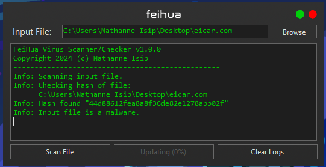

# Feihua


Feihua is a lightweight anti-virus and anti-malware program designed for Windows systems. It verifies file hashes against the VirusShare.com database, helping users detect known malware and viruses based on their unique identifiers.

Feihua "廢話" (pinyin: /fèi-huà/) translates closely to "nonsense."

<p align="center">
    
</p>

## Features

- **Hash Verification**: Feihua compares file hashes against a local database sourced from VirusShare.com.
- **Lightweight**: Designed to be resource-efficient and run smoothly on Windows systems.
- **Simple Interface**: User-friendly interface for easy hash checking and malware detection.

## Usage

1. **Installation**:
    - Download the latest release from the [releases](https://github.com/nthnn/Feihua/releases) page.
    - Extract the downloaded zip file to a preferred location on your Windows machine.

2. **Running Feihua**:
    - Double-click on `Feihua.exe` to launch the application.
    - Click the `Update Database` button on first use or if you have no `hashes.sqlite3` on the extraction folder. This may take a while to finish depending on your network connection strength. Alternatively, you can download a pre-fetched `hashes.sqlite3` database from the [releases](https://github.com/nthnn/Feihua/releases).
    - Use the interface to select a file and check its hash against the VirusShare.com database with the `Scan File(s)` button.

3. **Verifying Files**:
    - Select a file using the browse button.
    - Feihua will calculate the hash of the selected file and compare it against the local database.
    - If a match is found, Feihua will alert you about the file's status based on VirusShare.com data.

## License

This project is licensed under the [MIT License](LICENSE).

```
Copyright 2024 Nathanne Isip

Permission is hereby granted, free of charge, to any person obtaining a copy of this software and associated documentation files (the “Software”), to deal in the Software without restriction, including without limitation the rights to use, copy, modify, merge, publish, distribute, sublicense, and/or sell copies of the Software, and to permit persons to whom the Software is furnished to do so, subject to the following conditions:

The above copyright notice and this permission notice shall be included in all copies or substantial portions of the Software.

THE SOFTWARE IS PROVIDED “AS IS”, WITHOUT WARRANTY OF ANY KIND, EXPRESS OR IMPLIED, INCLUDING BUT NOT LIMITED TO THE WARRANTIES OF MERCHANTABILITY, FITNESS FOR A PARTICULAR PURPOSE AND NONINFRINGEMENT. IN NO EVENT SHALL THE AUTHORS OR COPYRIGHT HOLDERS BE LIABLE FOR ANY CLAIM, DAMAGES OR OTHER LIABILITY, WHETHER IN AN ACTION OF CONTRACT, TORT OR OTHERWISE, ARISING FROM, OUT OF OR IN CONNECTION WITH THE SOFTWARE OR THE USE OR OTHER DEALINGS IN THE SOFTWARE.
```